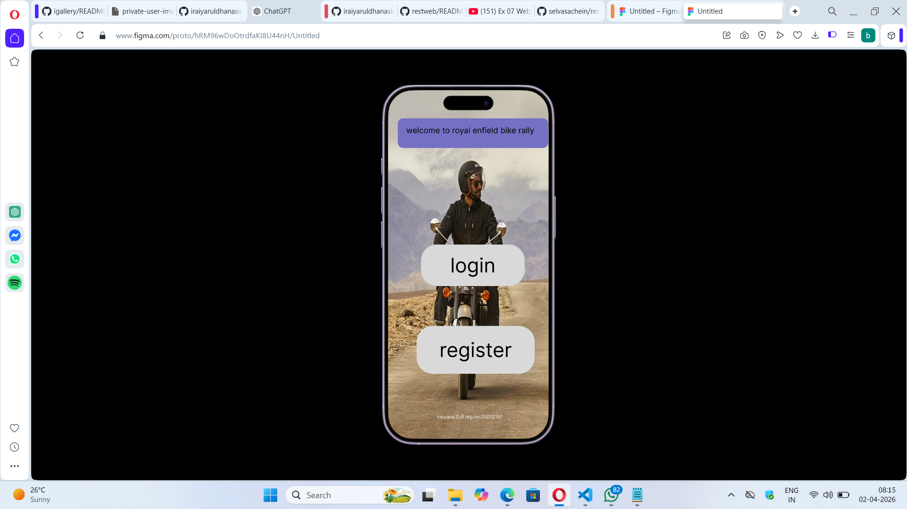

# Ex08 Event Registration Web Application
## Date:02/04/2026

## AIM:
To design, develop and deploy a web application for event registration using Figma UI tool.

## UI DESIGN TOOL:
Figma

## DESIGN STEPS:

### Step 1:
Use frames to represent screens or sections.

### Step 2:
Add column grids for consistent spacing and alignment.

### Step 3:
Insert shapes, text, buttons, and icons.

### Step 4:
Use Auto Layout for flexible, responsive design.

### Step 5:
Define color, text, and effect styles globally for consistency.

### Step 6:
Name layers logically and group related elements.

### Step 6:
Link frames to show navigation or interactions.

### Step 7:
Select the specific frame while generating code using Anima plugin.

## CODE:
```
page1.html
<!DOCTYPE html>
<html>
  <head>
    <meta name="viewport" content="width=device-width, initial-scale=1" />
    <meta charset="utf-8" />
    <link rel="stylesheet" href="globals.css" />
    <link rel="stylesheet" href="style.css" />
  </head>
  <body>
    <div class="iphone-pro">
      <div class="rectangle"></div>
      <div class="div"></div>
      <div class="text-wrapper">login</div>
      <div class="rounded-rectangle"></div>
      <p class="p">welcome to royal enfield bike rally</p>
      <div class="text-wrapper-2">register</div>
      <div class="text-wrapper-3">iraiyarul.D.R reg.no:25012197</div>
    </div>
  </body>
</html>
page1.css
.iphone-pro {
  overflow: hidden;
  background-image: url(./img/iphone-16-17-pro-1.png);
  background-size: cover;
  background-position: 50% 50%;
  width: 100%;
  min-width: 426px;
  min-height: 878px;
  position: relative;
}

.iphone-pro .rectangle {
  top: 387px;
  left: 83px;
  width: 259px;
  height: 104px;
  position: absolute;
  background-color: #d9d9d9;
  border-radius: 40px;
}

.iphone-pro .div {
  top: 591px;
  left: 72px;
  width: 295px;
  height: 120px;
  position: absolute;
  background-color: #d9d9d9;
  border-radius: 40px;
}

.iphone-pro .text-wrapper {
  position: absolute;
  top: 408px;
  left: 156px;
  width: 245px;
  font-family: "Inter-Regular", Helvetica;
  font-weight: 400;
  color: #000000;
  font-size: 50px;
  letter-spacing: 0;
  line-height: normal;
}

.iphone-pro .rounded-rectangle {
  position: absolute;
  top: 71px;
  left: 25px;
  width: 376px;
  height: 74px;
  background-color: #7470c2;
  border-radius: 13px;
}

.iphone-pro .p {
  position: absolute;
  top: 89px;
  left: 46px;
  width: 347px;
  font-family: "Inter-Regular", Helvetica;
  font-weight: 400;
  color: #000000;
  font-size: 20px;
  letter-spacing: 0;
  line-height: normal;
}

.iphone-pro .text-wrapper-2 {
  position: absolute;
  top: 620px;
  left: 129px;
  font-family: "Inter-Regular", Helvetica;
  font-weight: 400;
  color: #000000;
  font-size: 50px;
  letter-spacing: 0;
  line-height: normal;
}

.iphone-pro .text-wrapper-3 {
  position: absolute;
  top: 811px;
  left: 123px;
  width: 312px;
  font-family: "Inter-Regular", Helvetica;
  font-weight: 400;
  color: #ffffff;
  font-size: 12px;
  letter-spacing: 0;
  line-height: normal;
}
page2.html
<!DOCTYPE html>
<html>
  <head>
    <meta name="viewport" content="width=device-width, initial-scale=1" />
    <meta charset="utf-8" />
    <link rel="stylesheet" href="globals.css" />
    <link rel="stylesheet" href="style.css" />
  </head>
  <body>
    <div class="iphone-pro">
      
      <div class="rectangle"></div>
      
      
      
      <div class="div"></div>
      <div class="text-wrapper">login</div>
      <div class="text-wrapper-2">Email/username</div>
      <div class="text-wrapper-3">password</div>
    </div>
  </body>
</html>
page2.css
<!DOCTYPE html>
<html>
  <head>
    <meta name="viewport" content="width=device-width, initial-scale=1" />
    <meta charset="utf-8" />
    <link rel="stylesheet" href="globals.css" />
    <link rel="stylesheet" href="style.css" />
  </head>
  <body>
    <div class="iphone-pro">
      
      <div class="rectangle"></div>
      
      
      
      <div class="div"></div>
      <div class="text-wrapper">login</div>
      <div class="text-wrapper-2">Email/username</div>
      <div class="text-wrapper-3">password</div>
    </div>
  </body>
</html>
page3.html
<!DOCTYPE html>
<html>
  <head>
    <meta name="viewport" content="width=device-width, initial-scale=1" />
    <meta charset="utf-8" />
    <link rel="stylesheet" href="globals.css" />
    <link rel="stylesheet" href="style.css" />
  </head>
  <body>
    <div class="iphone-pro">
      <div class="rectangle"></div>
      <div class="div"></div>
      <div class="rectangle-2"></div>
      <div class="rectangle-3"></div>
      <div class="rectangle-4"></div>
      <div class="rectangle-5"></div>
      <div class="text-wrapper">name</div>
      <div class="text-wrapper-2">email</div>
      <div class="text-wrapper-3">phone</div>
      <div class="text-wrapper-4">password</div>
      <div class="text-wrapper-5">bike model</div>
      <div class="text-wrapper-6">register</div>
    </div>
  </body>
</html>
page3.css
.iphone-pro {
  background-image: url(./img/iphone-16-17-pro-3.png);
  background-size: cover;
  background-position: 50% 50%;
  width: 100%;
  min-width: 402px;
  min-height: 874px;
  position: relative;
}

.iphone-pro .rectangle {
  top: 334px;
  left: 66px;
  width: 264px;
  height: 77px;
  background-color: #ed6e6e;
  position: absolute;
  border-radius: 30px;
}

.iphone-pro .div {
  top: 226px;
  left: 70px;
  width: 217px;
  height: 61px;
  background-color: #ff7a7a;
  position: absolute;
  border-radius: 30px;
}

.iphone-pro .rectangle-2 {
  top: 132px;
  left: 74px;
  width: 176px;
  height: 73px;
  background-color: #ff7b7b;
  position: absolute;
  border-radius: 30px;
}

.iphone-pro .rectangle-3 {
  top: 50px;
  left: 70px;
  width: 180px;
  height: 68px;
  background-color: #eb7e7e;
  position: absolute;
  border-radius: 30px;
}

.iphone-pro .rectangle-4 {
  top: 439px;
  left: 66px;
  width: 285px;
  height: 76px;
  background-color: #e06767;
  position: absolute;
  border-radius: 30px;
}

.iphone-pro .rectangle-5 {
  top: 671px;
  left: 78px;
  width: 245px;
  height: 80px;
  background-color: #d9d9d9;
  position: absolute;
  border-radius: 30px;
}

.iphone-pro .text-wrapper {
  position: absolute;
  top: 50px;
  left: 85px;
  font-family: "Inter-Regular", Helvetica;
  font-weight: 400;
  color: #000000;
  font-size: 50px;
  letter-spacing: 0;
  line-height: normal;
}

.iphone-pro .text-wrapper-2 {
  position: absolute;
  top: 132px;
  left: 85px;
  width: 149px;
  font-family: "Inter-Regular", Helvetica;
  font-weight: 400;
  color: #000000;
  font-size: 50px;
  letter-spacing: 0;
  line-height: normal;
  white-space: nowrap;
}

.iphone-pro .text-wrapper-3 {
  position: absolute;
  top: 226px;
  left: 93px;
  font-family: "Inter-Regular", Helvetica;
  font-weight: 400;
  color: #000000;
  font-size: 50px;
  letter-spacing: 0;
  line-height: normal;
}

.iphone-pro .text-wrapper-4 {
  position: absolute;
  top: 334px;
  left: 74px;
  width: 256px;
  font-family: "Inter-Regular", Helvetica;
  font-weight: 400;
  color: #000000;
  font-size: 50px;
  letter-spacing: 0;
  line-height: normal;
  white-space: nowrap;
}

.iphone-pro .text-wrapper-5 {
  position: absolute;
  top: 437px;
  left: 67px;
  font-family: "Inter-Regular", Helvetica;
  font-weight: 400;
  color: #000000;
  font-size: 50px;
  letter-spacing: 0;
  line-height: normal;
}

.iphone-pro .text-wrapper-6 {
  position: absolute;
  top: 680px;
  left: 106px;
  font-family: "Inter-Regular", Helvetica;
  font-weight: 400;
  color: #000000;
  font-size: 50px;
  letter-spacing: 0;
  line-height: normal;
}
page4.html
<!DOCTYPE html>
<html>
  <head>
    <meta name="viewport" content="width=device-width, initial-scale=1" />
    <meta charset="utf-8" />
    <link rel="stylesheet" href="globals.css" />
    <link rel="stylesheet" href="style.css" />
  </head>
  <body>
    <div class="iphone-pro">
      <div class="rectangle"></div>
      <div class="div"></div>
      <div class="text-wrapper">bike details</div>
      <div class="text-wrapper-2">logout</div>
    </div>
  </body>
</html>
page4.css
.iphone-pro {
  background-image: url(./img/iphone-16-17-pro-4.png);
  background-size: cover;
  background-position: 50% 50%;
  width: 100%;
  min-width: 402px;
  min-height: 874px;
  position: relative;
}

.iphone-pro .rectangle {
  top: 100px;
  left: 53px;
  width: 306px;
  height: 337px;
  border-radius: 50px;
  position: absolute;
  background-color: #d9d9d9;
}

.iphone-pro .div {
  top: 630px;
  left: 56px;
  width: 303px;
  height: 134px;
  border-radius: 40px;
  position: absolute;
  background-color: #d9d9d9;
}

.iphone-pro .text-wrapper {
  position: absolute;
  top: 142px;
  left: 73px;
  font-family: "Inter-Regular", Helvetica;
  font-weight: 400;
  color: #000000;
  font-size: 50px;
  letter-spacing: 0;
  line-height: normal;
}

.iphone-pro .text-wrapper-2 {
  position: absolute;
  top: 666px;
  left: 139px;
  font-family: "Inter-Regular", Helvetica;
  font-weight: 400;
  color: #000000;
  font-size: 50px;
  letter-spacing: 0;
  line-height: normal;
}


```

## OUTPUT:



## RESULT:
The program to design, develop and deploy a web application for event registration using Figma UI tool is completed successfully.
