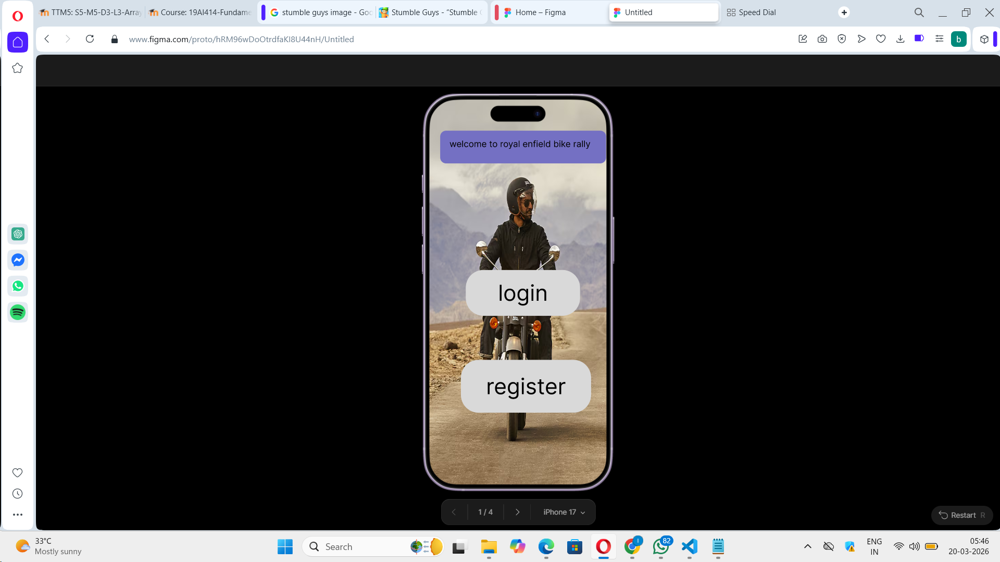
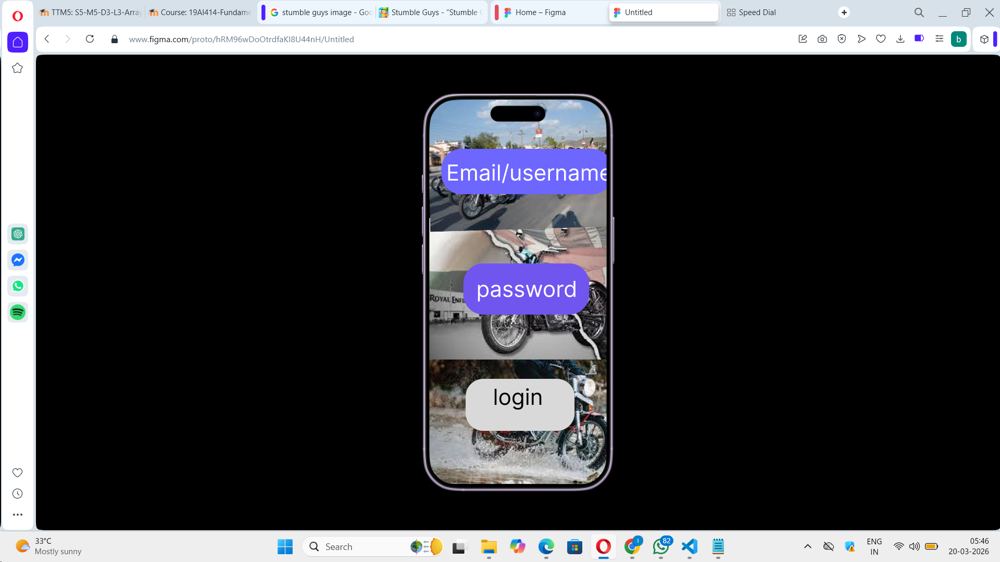
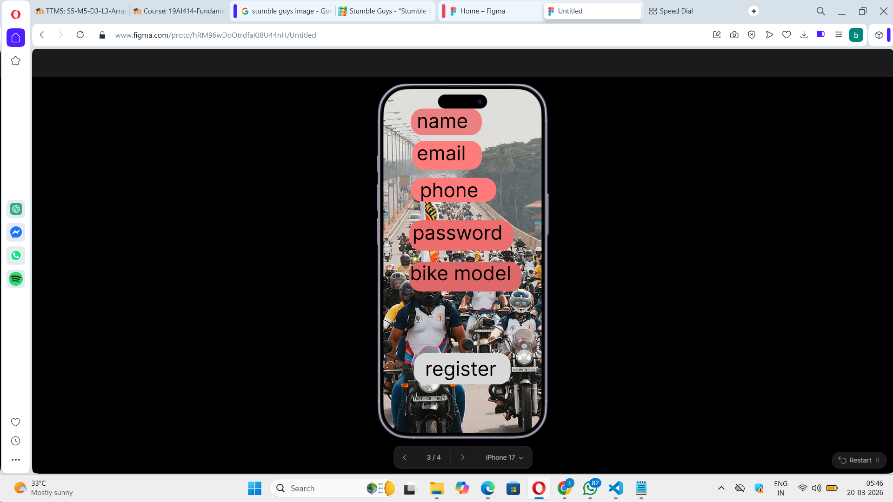
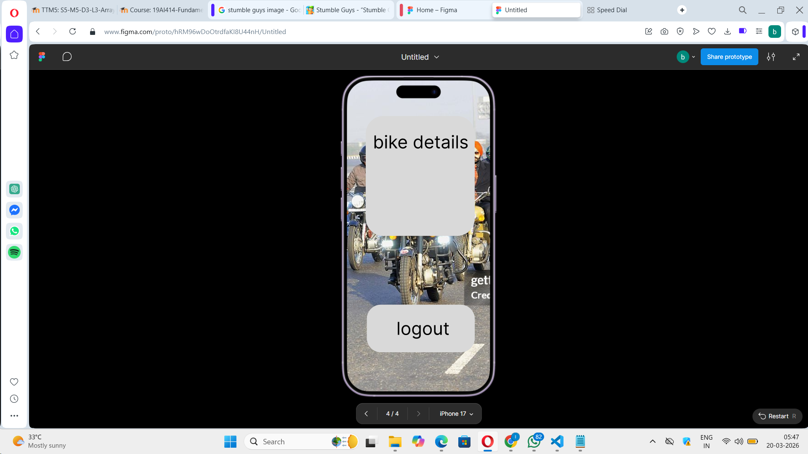

# Ex08 Event Registration Web Application
## Date:20/01/2026

## AIM:
To design, develop and deploy a web application for event registration using Figma UI tool.

## UI DESIGN TOOL:
Figma

## DESIGN STEPS:

### Step 1:
Use frames to represent screens or sections.

### Step 2:
Add column grids for consistent spacing and alignment.

### Step 3:
Insert shapes, text, buttons, and icons.

### Step 4:
Use Auto Layout for flexible, responsive design.

### Step 5:
Define color, text, and effect styles globally for consistency.

### Step 6:
Name layers logically and group related elements.

### Step 6:
Link frames to show navigation or interactions.

### Step 7:
Select the specific frame while generating code using Anima plugin.

## CODE:
```
page 1

import { useState } from "react";

export const IphonePro = (): JSX.Element => {
  const [currentView, setCurrentView] = useState<"home" | "login" | "register">(
    "home",
  );

  const handleLogin = (e: React.FormEvent) => {
    e.preventDefault();
    setCurrentView("home");
  };

  const handleRegister = (e: React.FormEvent) => {
    e.preventDefault();
    setCurrentView("home");
  };

  if (currentView === "login") {
    return (
      <div className="bg-[url(/iphone-16-17-pro-1.png)] bg-cover bg-[50%_50%] w-full min-w-[426px] min-h-[878px] relative flex flex-col items-center justify-center">
        <div className="absolute top-[71px] left-[25px] w-[376px] h-[74px] bg-[#7470c2] rounded-[13px]" />
        <p className="absolute top-[89px] left-[46px] w-[347px] [font-family:'Inter-Regular',Helvetica] font-normal text-black text-xl tracking-[0] leading-[normal]">
          welcome to royal enfield bike rally
        </p>
        <div className="bg-white/80 backdrop-blur-sm rounded-[40px] p-8 w-[320px] flex flex-col gap-4 z-10">
          <h2 className="[font-family:'Inter-Regular',Helvetica] font-normal text-black text-[40px] tracking-[0] leading-[normal] text-center">
            login
          </h2>
          <form onSubmit={handleLogin} className="flex flex-col gap-4">
            <div className="flex flex-col gap-1">
              <label className="[font-family:'Inter-Regular',Helvetica] font-normal text-black text-base tracking-[0] leading-[normal]">
                Username
              </label>
              <input
                type="text"
                placeholder="Enter username"
                className="border border-gray-300 rounded-[10px] px-4 py-2 [font-family:'Inter-Regular',Helvetica] font-normal text-black text-base tracking-[0] leading-[normal] bg-white outline-none"
              />
            </div>
            <div className="flex flex-col gap-1">
              <label className="[font-family:'Inter-Regular',Helvetica] font-normal text-black text-base tracking-[0] leading-[normal]">
                Password
              </label>
              <input
                type="password"
                placeholder="Enter password"
                className="border border-gray-300 rounded-[10px] px-4 py-2 [font-family:'Inter-Regular',Helvetica] font-normal text-black text-base tracking-[0] leading-[normal] bg-white outline-none"
              />
            </div>
            <button
              type="submit"
              className="bg-[#7470c2] text-white rounded-[13px] py-3 [font-family:'Inter-Regular',Helvetica] font-normal text-xl tracking-[0] leading-[normal] mt-2"
            >
              login
            </button>
            <button
              type="button"
              onClick={() => setCurrentView("home")}
              className="text-black [font-family:'Inter-Regular',Helvetica] font-normal text-base tracking-[0] leading-[normal] text-center underline"
            >
              back
            </button>
          </form>
        </div>
      </div>
    );
  }

  if (currentView === "register") {
    return (
      <div className="bg-[url(/iphone-16-17-pro-1.png)] bg-cover bg-[50%_50%] w-full min-w-[426px] min-h-[878px] relative flex flex-col items-center justify-center">
        <div className="absolute top-[71px] left-[25px] w-[376px] h-[74px] bg-[#7470c2] rounded-[13px]" />
        <p className="absolute top-[89px] left-[46px] w-[347px] [font-family:'Inter-Regular',Helvetica] font-normal text-black text-xl tracking-[0] leading-[normal]">
          welcome to royal enfield bike rally
        </p>
        <div className="bg-white/80 backdrop-blur-sm rounded-[40px] p-8 w-[320px] flex flex-col gap-4 z-10">
          <h2 className="[font-family:'Inter-Regular',Helvetica] font-normal text-black text-[40px] tracking-[0] leading-[normal] text-center">
            register
          </h2>
          <form onSubmit={handleRegister} className="flex flex-col gap-4">
            <div className="flex flex-col gap-1">
              <label className="[font-family:'Inter-Regular',Helvetica] font-normal text-black text-base tracking-[0] leading-[normal]">
                Full Name
              </label>
              <input
                type="text"
                placeholder="Enter full name"
                className="border border-gray-300 rounded-[10px] px-4 py-2 [font-family:'Inter-Regular',Helvetica] font-normal text-black text-base tracking-[0] leading-[normal] bg-white outline-none"
              />
            </div>
            <div className="flex flex-col gap-1">
              <label className="[font-family:'Inter-Regular',Helvetica] font-normal text-black text-base tracking-[0] leading-[normal]">
                Username
              </label>
              <input
                type="text"
                placeholder="Enter username"
                className="border border-gray-300 rounded-[10px] px-4 py-2 [font-family:'Inter-Regular',Helvetica] font-normal text-black text-base tracking-[0] leading-[normal] bg-white outline-none"
              />
            </div>
            <div className="flex flex-col gap-1">
              <label className="[font-family:'Inter-Regular',Helvetica] font-normal text-black text-base tracking-[0] leading-[normal]">
                Password
              </label>
              <input
                type="password"
                placeholder="Enter password"
                className="border border-gray-300 rounded-[10px] px-4 py-2 [font-family:'Inter-Regular',Helvetica] font-normal text-black text-base tracking-[0] leading-[normal] bg-white outline-none"
              />
            </div>
            <div className="flex flex-col gap-1">
              <label className="[font-family:'Inter-Regular',Helvetica] font-normal text-black text-base tracking-[0] leading-[normal]">
                Confirm Password
              </label>
              <input
                type="password"
                placeholder="Confirm password"
                className="border border-gray-300 rounded-[10px] px-4 py-2 [font-family:'Inter-Regular',Helvetica] font-normal text-black text-base tracking-[0] leading-[normal] bg-white outline-none"
              />
            </div>
            <button
              type="submit"
              className="bg-[#7470c2] text-white rounded-[13px] py-3 [font-family:'Inter-Regular',Helvetica] font-normal text-xl tracking-[0] leading-[normal] mt-2"
            >
              register
            </button>
            <button
              type="button"
              onClick={() => setCurrentView("home")}
              className="text-black [font-family:'Inter-Regular',Helvetica] font-normal text-base tracking-[0] leading-[normal] text-center underline"
            >
              back
            </button>
          </form>
        </div>
      </div>
    );
  }

  return (
    <div className="bg-[url(/iphone-16-17-pro-1.png)] bg-cover bg-[50%_50%] w-full min-w-[426px] min-h-[878px] relative">
      <button
        onClick={() => setCurrentView("login")}
        className="top-[387px] left-[83px] w-[259px] h-[104px] absolute bg-[#d9d9d9] rounded-[40px] cursor-pointer hover:bg-[#c9c9c9] transition-colors"
        aria-label="Login"
      />

      <button
        onClick={() => setCurrentView("register")}
        className="top-[591px] left-[72px] w-[295px] h-[120px] absolute bg-[#d9d9d9] rounded-[40px] cursor-pointer hover:bg-[#c9c9c9] transition-colors"
        aria-label="Register"
      />

      <div
        className="absolute top-[408px] left-[156px] w-[245px] [font-family:'Inter-Regular',Helvetica] font-normal text-black text-[50px] tracking-[0] leading-[normal] pointer-events-none"
        onClick={() => setCurrentView("login")}
      >
        login
      </div>

      <div className="absolute top-[71px] left-[25px] w-[376px] h-[74px] bg-[#7470c2] rounded-[13px]" />

      <p className="absolute top-[89px] left-[46px] w-[347px] [font-family:'Inter-Regular',Helvetica] font-normal text-black text-xl tracking-[0] leading-[normal]">
        welcome to royal enfield bike rally
      </p>

      <div
        className="absolute top-[620px] left-[129px] [font-family:'Inter-Regular',Helvetica] font-normal text-black text-[50px] tracking-[0] leading-[normal] pointer-events-none"
        onClick={() => setCurrentView("register")}
      >
        register
      </div>
    </div>
  );
};


page-2

import { useState } from "react";
import re41 from "./re4-1.png";
import re61 from "./re6-1.png";
import re71 from "./re7-1.png";
import rectangle4 from "./rectangle-4.svg";

export const IphonePro = (): JSX.Element => {
  const [email, setEmail] = useState("");
  const [password, setPassword] = useState("");

  const handleLogin = (e: React.FormEvent) => {
    e.preventDefault();
  };

  return (
    <div className="overflow-hidden bg-[url(/iphone-16-17-pro-2.png)] bg-cover bg-[50%_50%] w-full min-w-[441px] min-h-[874px] relative">
      

      <div className="absolute top-[634px] left-[83px] w-[247px] h-[118px] bg-[#d9d9d9] rounded-[40px]" />

      

      

      

      <div className="absolute top-28 left-7 w-[387px] h-[103px] bg-[#6d65ff] rounded-[45px]" />

      <form onSubmit={handleLogin} className="contents">
        <label htmlFor="email-input" className="sr-only">
          Email or Username
        </label>
        <input
          id="email-input"
          type="text"
          value={email}
          onChange={(e) => setEmail(e.target.value)}
          placeholder="Email/username"
          aria-label="Email or Username"
          className="absolute top-28 left-7 w-[387px] h-[103px] rounded-[45px] bg-transparent [font-family:'Inter-Regular',Helvetica] font-normal text-white text-[50px] tracking-[0] leading-[normal] whitespace-nowrap px-[39px] placeholder-white z-10"
        />

        <label htmlFor="password-input" className="sr-only">
          Password
        </label>
        <input
          id="password-input"
          type="password"
          value={password}
          onChange={(e) => setPassword(e.target.value)}
          placeholder="password"
          aria-label="Password"
          className="absolute top-[372px] left-[78px] w-[285px] h-[116px] rounded-[45px] bg-transparent [font-family:'Inter-Regular',Helvetica] font-normal text-white text-[50px] tracking-[0] leading-[normal] px-[29px] placeholder-white z-10"
        />

        <button
          type="submit"
          aria-label="Login"
          className="absolute top-[634px] left-[83px] w-[247px] h-[118px] rounded-[40px] bg-transparent z-10 cursor-pointer"
        />
      </form>

      <div className="absolute top-[644px] left-[145px] w-[123px] [font-family:'Inter-Regular',Helvetica] font-normal text-black text-[50px] tracking-[0] leading-[normal] pointer-events-none">
        login
      </div>

      <div className="absolute top-[135px] left-[39px] w-[458px] [font-family:'Inter-Regular',Helvetica] font-normal text-white text-[50px] tracking-[0] leading-[normal] whitespace-nowrap pointer-events-none">
        Email/username
      </div>

      <div className="absolute top-[399px] left-[107px] w-[230px] [font-family:'Inter-Regular',Helvetica] font-normal text-white text-[50px] tracking-[0] leading-[normal] pointer-events-none">
        password
      </div>
    </div>
  );
};

page -3

import { useState } from "react";

export const IphonePro = (): JSX.Element => {
  const [formData, setFormData] = useState({
    name: "",
    email: "",
    phone: "",
    password: "",
    bikeModel: "",
  });

  const handleChange = (e: React.ChangeEvent<HTMLInputElement>) => {
    const { name, value } = e.target;
    setFormData((prev) => ({ ...prev, [name]: value }));
  };

  const handleSubmit = (e: React.FormEvent<HTMLFormElement>) => {
    e.preventDefault();
    console.log("Form submitted:", formData);
  };

  return (
    <div className="bg-[url(/iphone-16-17-pro-3.png)] bg-cover bg-[50%_50%] w-full min-w-[402px] min-h-[874px] relative">
      <form onSubmit={handleSubmit} noValidate>
        {/* Name field */}
        <div className="top-[50px] left-[70px] w-[180px] h-[68px] bg-[#eb7e7e] absolute rounded-[30px]" />
        <input
          type="text"
          name="name"
          value={formData.name}
          onChange={handleChange}
          placeholder="name"
          aria-label="Name"
          className="absolute top-[50px] left-[85px] w-[149px] h-[68px] [font-family:'Inter-Regular',Helvetica] font-normal text-black text-[50px] tracking-[0] leading-[normal] bg-transparent border-none outline-none placeholder-black"
        />

        {/* Email field */}
        <div className="top-[132px] left-[74px] w-44 h-[73px] bg-[#ff7b7b] absolute rounded-[30px]" />
        <input
          type="email"
          name="email"
          value={formData.email}
          onChange={handleChange}
          placeholder="email"
          aria-label="Email"
          className="absolute top-[132px] left-[85px] w-[149px] h-[73px] [font-family:'Inter-Regular',Helvetica] font-normal text-black text-[50px] tracking-[0] leading-[normal] bg-transparent border-none outline-none placeholder-black whitespace-nowrap"
        />

        {/* Phone field */}
        <div className="top-[226px] left-[70px] w-[217px] h-[61px] bg-[#ff7a7a] absolute rounded-[30px]" />
        <input
          type="tel"
          name="phone"
          value={formData.phone}
          onChange={handleChange}
          placeholder="phone"
          aria-label="Phone"
          className="absolute top-[226px] left-[93px] w-[180px] h-[61px] [font-family:'Inter-Regular',Helvetica] font-normal text-black text-[50px] tracking-[0] leading-[normal] bg-transparent border-none outline-none placeholder-black"
        />

        {/* Password field */}
        <div className="top-[334px] left-[66px] w-[264px] h-[77px] bg-[#ed6e6e] absolute rounded-[30px]" />
        <input
          type="password"
          name="password"
          value={formData.password}
          onChange={handleChange}
          placeholder="password"
          aria-label="Password"
          className="absolute top-[334px] left-[74px] w-64 h-[77px] [font-family:'Inter-Regular',Helvetica] font-normal text-black text-[50px] tracking-[0] leading-[normal] bg-transparent border-none outline-none placeholder-black whitespace-nowrap"
        />

        {/* Bike model field */}
        <div className="top-[439px] left-[66px] w-[285px] h-[76px] bg-[#e06767] absolute rounded-[30px]" />
        <input
          type="text"
          name="bikeModel"
          value={formData.bikeModel}
          onChange={handleChange}
          placeholder="bike model"
          aria-label="Bike Model"
          className="absolute top-[437px] left-[67px] w-[270px] h-[76px] [font-family:'Inter-Regular',Helvetica] font-normal text-black text-[50px] tracking-[0] leading-[normal] bg-transparent border-none outline-none placeholder-black"
        />

        {/* Register button */}
        <div className="top-[671px] left-[78px] w-[245px] h-20 bg-[#d9d9d9] absolute rounded-[30px]" />
        <button
          type="submit"
          aria-label="Register"
          className="absolute top-[671px] left-[78px] w-[245px] h-20 rounded-[30px] bg-transparent border-none outline-none cursor-pointer flex items-center justify-center"
        >
          <span className="[font-family:'Inter-Regular',Helvetica] font-normal text-black text-[50px] tracking-[0] leading-[normal]">
            register
          </span>
        </button>
      </form>
    </div>
  );
  
  page-4
  export const IphonePro = (): JSX.Element => {
  return (
    <div className="bg-[url(/iphone-16-17-pro-4.png)] bg-cover bg-[50%_50%] w-full min-w-[402px] min-h-[874px] relative">
      <div className="top-[100px] left-[53px] w-[306px] h-[337px] rounded-[50px] absolute bg-[#d9d9d9]" />

      <div className="top-[630px] left-14 w-[303px] h-[134px] rounded-[40px] absolute bg-[#d9d9d9]" />

      <div className="absolute top-[142px] left-[73px] [font-family:'Inter-Regular',Helvetica] font-normal text-black text-[50px] tracking-[0] leading-[normal]">
        bike details
      </div>

      <div className="absolute top-[666px] left-[139px] [font-family:'Inter-Regular',Helvetica] font-normal text-black text-[50px] tracking-[0] leading-[normal]">
        logout
      </div>
    </div>
  );
};

};


```

## OUTPUT:





## RESULT:
The program to design, develop and deploy a web application for event registration using Figma UI tool is completed successfully.
